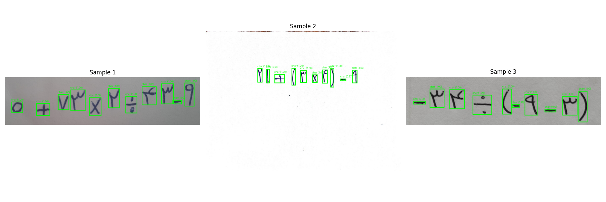
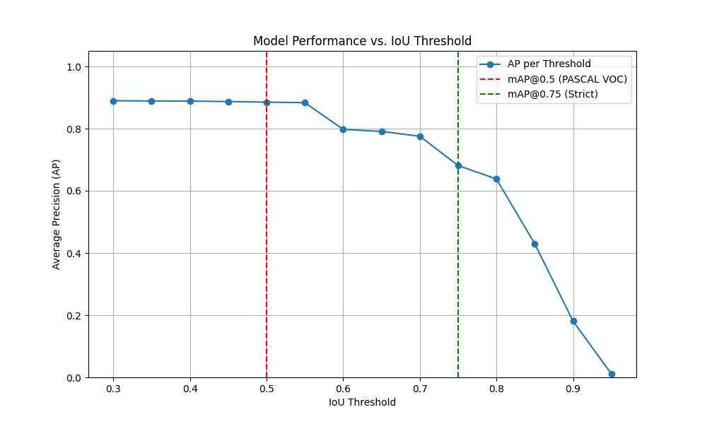
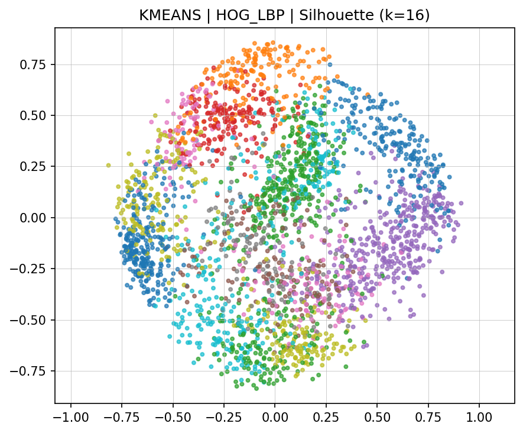
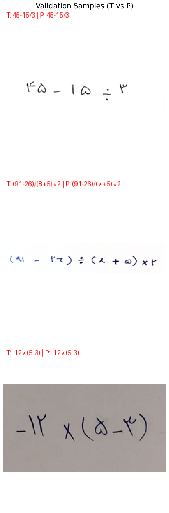

# Handwritten Character Localization and Recognition

An end-to-end machine-learning course project for handwritten mathematical expressions. The pipeline combines **character localization**, **unsupervised character clustering**, and **semi-supervised character recognition**.

## Pipeline

1. **Character localization** using a custom Faster R-CNN-style detector.
2. **Unsupervised clustering** using Raw/HOG/LBP features, PCA, and K-Means/Agglomerative/GMM clustering.
3. **Semi-supervised recognition** using a FixMatch-style training pipeline with a small labeled set and a much larger unlabeled set.

## Results

| Stage | Result |
|---|---:|
| Localization mAP@[0.50:0.95] | **64.4%** |
| Localization mAP@0.50 | **92.4%** |
| Localization mAP@0.75 | **79.4%** |
| Best clustering by Silhouette | **HOG + PCA(16) + K-Means, 0.228** |
| Best clustering by Davies-Bouldin | **LBP + no PCA + K-Means, 1.297** |
| FixMatch validation accuracy | **92.7%** |
| FixMatch weighted F1 | **93.0%** |

The semi-supervised stage used **96 labeled character crops** and **2720 unlabeled character crops**. The best confidence threshold reported in the final experiments was **0.95**.

## Example outputs

### Character localization





### Character clustering



### Character recognition



## Repository structure

```text
.
├── src/
│   ├── faster_rcnn.py
│   ├── character_clustering.py
│   └── fixmatch_char_pipeline.py
├── assets/
├── dataset/
│   └── README.md
├── results/
│   └── .gitkeep
├── visualizations.ipynb
├── requirements.txt
└── README.md
```

## Installation

```bash
python -m venv .venv
source .venv/bin/activate  # Linux/macOS
pip install -r requirements.txt
```

For GPU-enabled PyTorch, install the build appropriate for your CUDA version from the official PyTorch installation instructions.

## Usage

Run localization first:

```bash
python src/faster_rcnn.py
```

Run the clustering grid:

```bash
python src/character_clustering.py \
  --run_grid \
  --grid_features raw hog lbp hog_lbp \
  --grid_clusters kmeans agglomerative gmm \
  --grid_metrics silhouette db \
  --k 16
```

Then run semi-supervised recognition:

```bash
python src/fixmatch_char_pipeline.py
```

The recognition script expects localization output at `results/faster_rcnn/output.csv` by default.

## Team

- Zakiye Rostamirad
- Mohammadreza Firoozalizadeh

## Notes

- The original course report and full dataset are intentionally not included in this public repository.
- Generated model checkpoints and result folders are ignored by Git.
- The repository focuses on the implementation, evaluation pipeline, and selected visual results rather than publishing full assignment solutions.
